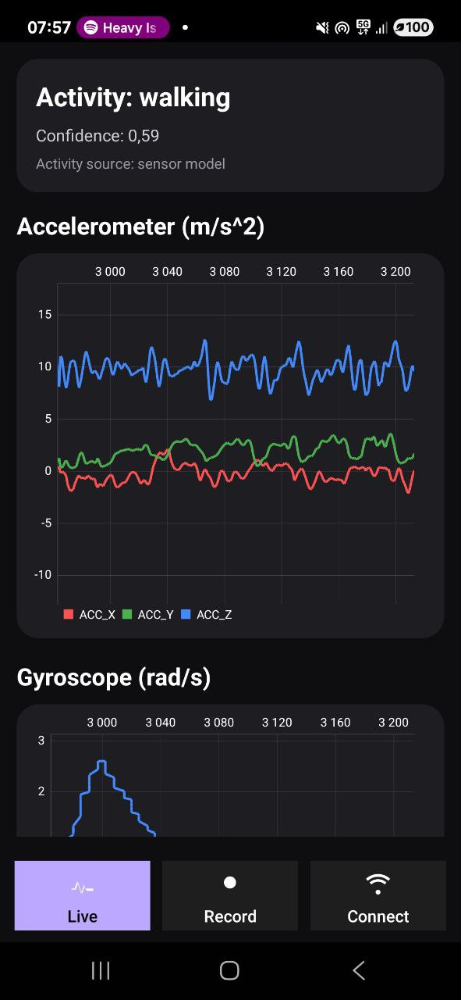
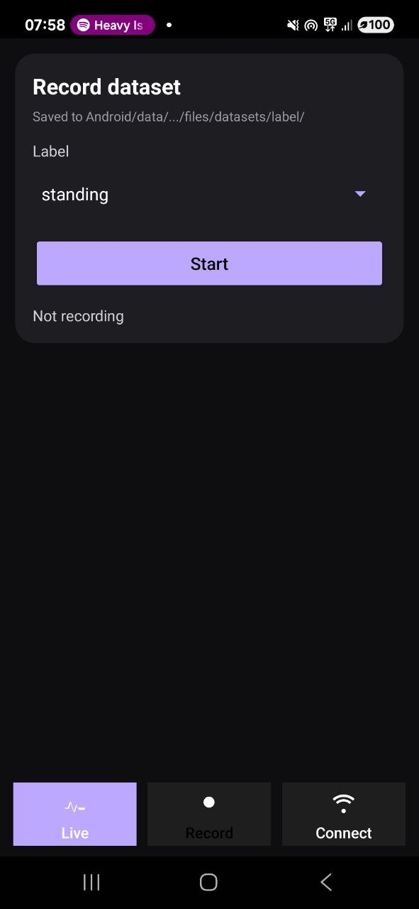
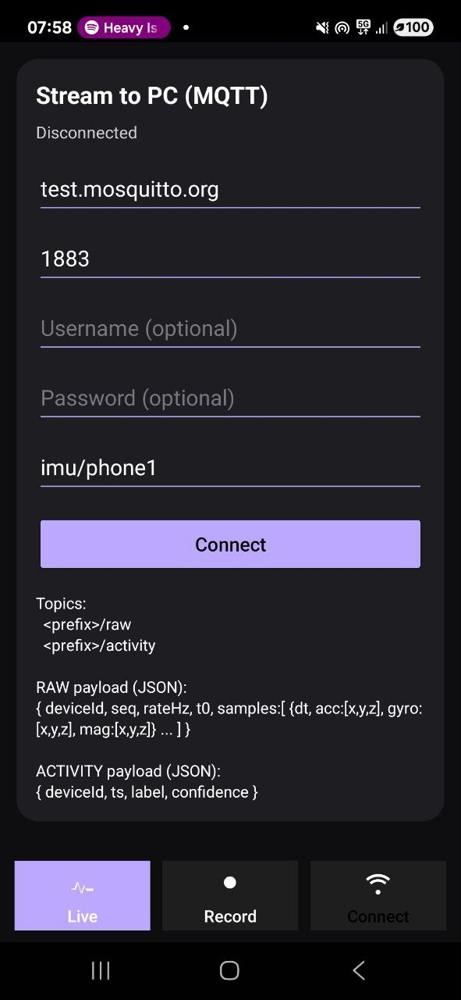
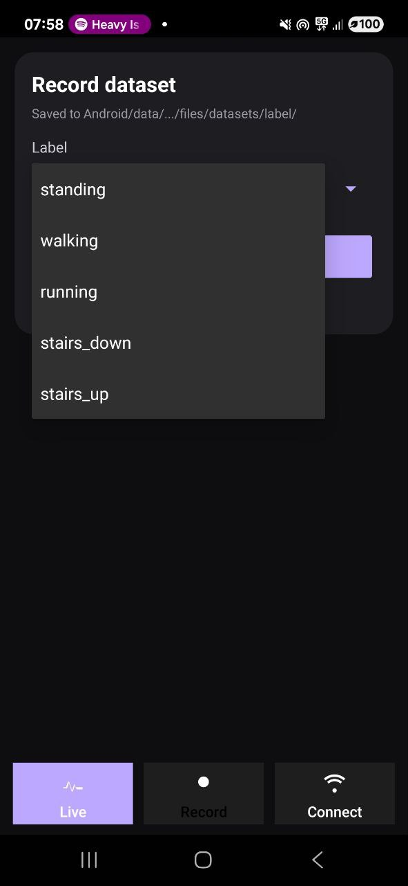
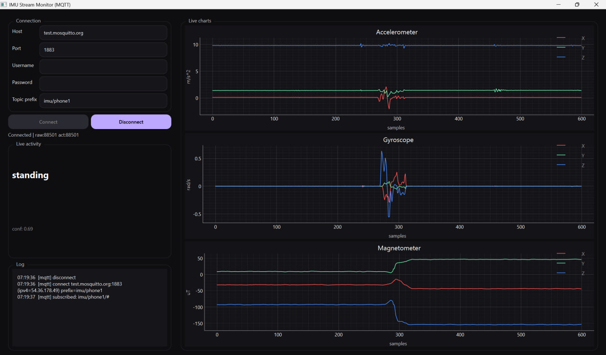

# ImuRecorder

**ImuRecorder** is an Android + PC system for recording IMU sensor data, creating custom datasets, training an activity-recognition model, and monitoring live sensor streams on a computer.

The project implements the full workflow:

```text
IMU data capture → dataset creation → model training → live prediction → MQTT streaming → PC monitoring
```

## Project screenshots

### Android application

The Android app displays live IMU data, records datasets, trains/uses the activity-recognition model, and sends data to the PC through MQTT.

<p align="center">
  
  
  
</p>

### Dataset recording mode

In dataset mode, the user selects an activity label, starts recording, performs the movement, and stops the session. The collected samples are saved as CSV files and can later be used for model training.

<p align="center">
  
</p>

### PC receiver application

The PC application connects to the MQTT broker, subscribes to IMU topics, displays live charts, and shows the predicted activity with confidence.

<p align="center">
  
</p>

---

## Main features

### Android app

- Reads data from three IMU sensors:
  - accelerometer: `ax, ay, az`
  - gyroscope: `gx, gy, gz`
  - magnetometer: `mx, my, mz`
- Displays real-time charts on the phone.
- Records datasets using a simple Start/Stop workflow.
- Saves recordings as CSV files grouped by activity label.
- Trains and uses a local machine-learning model for activity recognition.
- Shows live prediction result:
  - activity `label`
  - prediction `confidence`
- Publishes raw IMU data and prediction results through MQTT.

### PC receiver app

- Connects to a public or private MQTT broker.
- Subscribes to the same topic prefix as the phone.
- Receives IMU packets in real time.
- Displays three live charts:
  - accelerometer
  - gyroscope
  - magnetometer
- Displays the recognized activity and confidence value.
- Shows connection status and message logs.

---

## Architecture

The system consists of two independent but connected parts:

```text
Android phone
  ├─ reads IMU sensors
  ├─ records datasets
  ├─ trains / runs ML model
  └─ publishes MQTT messages

MQTT broker
  └─ transfers data between phone and PC

PC receiver
  ├─ subscribes to MQTT topics
  ├─ receives raw IMU data
  ├─ receives activity prediction
  └─ displays charts and status panel
```

The final version uses MQTT instead of Bluetooth. This makes the connection easier to test and more flexible because the phone and PC do not have to be in the same local network.

---

## Machine learning

The final classifier used in the project is:

### ExtraTreesClassifier

The model works on sliding windows of IMU data:

1. Raw IMU samples are collected from 9 channels.
2. The signal is split into sliding windows, for example 128 samples with step 64.
3. Statistical features are extracted from every window.
4. The classifier predicts the current activity.
5. The application displays the predicted label and confidence.

Example features calculated for every sensor axis:

- mean
- standard deviation
- minimum
- maximum
- signal energy

ExtraTreesClassifier was selected because it is fast, works well with tabular statistical features, does not require feature scaling, and is practical for real-time prediction on a phone.

---

## Dataset structure

Datasets are stored in folders named after activity labels:

```text
datasets/
  walking/
    *.csv
  standing/
    *.csv
  running/
    *.csv
  stairs_up/
    *.csv
  stairs_down/
    *.csv
```

Each CSV file represents one recording session.

CSV row format:

```text
ts, ax, ay, az, gx, gy, gz, mx, my, mz
```

Where:

- `ts` is the sample timestamp,
- `ax, ay, az` are accelerometer values,
- `gx, gy, gz` are gyroscope values,
- `mx, my, mz` are magnetometer values.

The model can be retrained after new recordings are added, so the recognition system becomes better adjusted to the user and device over time.

---

## MQTT communication

ImuRecorder uses MQTT publish/subscribe communication.

The phone publishes data to a broker, and the PC receiver subscribes to the same topics.

Example topic prefix:

```text
imu/phone1
```

Topics:

```text
imu/phone1/raw       - raw IMU data packets
imu/phone1/activity  - activity prediction: label + confidence
```

A public broker such as `test.mosquitto.org` can be used for quick testing.

Important note: public brokers are convenient, but they do not guarantee privacy. Use a unique topic prefix or a private broker for real use.

---

## How to run

### 1. Android app

Requirements:

- Android Studio
- Android phone with IMU sensors
- Internet connection when MQTT streaming is used

Steps:

1. Open the project in Android Studio.
2. Build and run the app on a physical Android phone.
3. Select an activity label.
4. Record datasets using Start/Stop.
5. Enable MQTT streaming.
6. Set MQTT parameters, for example:

```text
Host: test.mosquitto.org
Port: 1883
Topic prefix: imu/phone1
```

### 2. PC receiver

Requirements:

- Python 3.10+
- Windows or Linux
- MQTT broker access

Install dependencies:

```bash
cd Receiver
pip install -r requirements.txt
```

Run the receiver:

```bash
python main.py
```

Example settings:

```text
Host: test.mosquitto.org
Port: 1883
Topic prefix: imu/phone1
```

The topic prefix must be the same on the phone and on the PC receiver.

---

## Technologies used

- **Android / Kotlin** — mobile application and access to phone sensors.
- **SensorManager** — reading accelerometer, gyroscope, and magnetometer data.
- **Machine Learning** — activity classification from IMU windows.
- **ExtraTreesClassifier** — final classifier used for prediction.
- **MQTT** — communication between phone and PC.
- **Python** — PC receiver application.
- **PySide6 / Qt** — desktop GUI.
- **pyqtgraph** — fast real-time charts.
- **paho-mqtt** — MQTT client for Python.

---

## Possible future improvements

- Support for multiple phones as independent IMU sensors.
- Saving received data on the PC side.
- Session replay in the PC application.
- Private MQTT broker with TLS and authentication.
- More activity classes.
- Web dashboard for remote monitoring.

---
